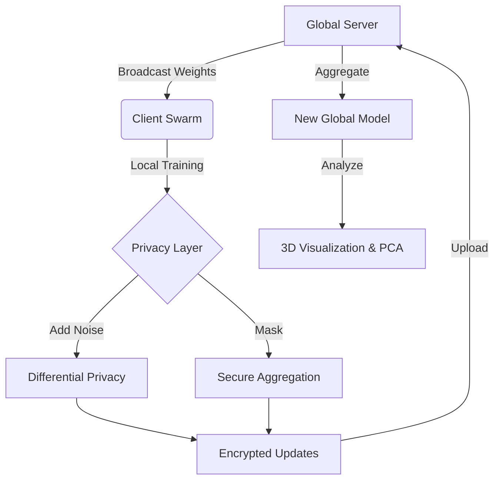

# 🛰️ FedVisualizer: The Ultimate Federated Learning Command Center


> **"Where Cyberpunk Aesthetics Meet Rigorous Scientific Simulation."**

**FedVisualizer** is a state-of-the-art research platform designed to demystify the "black box" of Federated Learning. It combines rigorous mathematical simulation with a Hollywood-grade visual interface, allowing researchers to observe, attack, and optimize distributed AI networks in real-time.

---

## 🌌 High-Fidelity Visualizations

### 🏔️ **3D Loss Landscape Expedition**
Journey into the optimization valley of your neural network.
*   **Real-time Surface Plot:** Visualize the convexity of the loss function.
*   **Trajectory Tracking:** Watch the global model descent into the minima.
*   **Topology Classification:** Automatically classifies minima as **"🟢 Wide (Stable)"** or **"🔴 Sharp (Brittle)"**.
*   **Dynamic Zoom:** Camera intelligently clamps to the optimization path for dramatic "canyon dive" views.

### 🧬 **Weight Space Monitor (PCA)**
See the invisible latent space of model parameters.
*   **Latent Projection:** Uses incremental PCA to project high-dimensional weight vectors into 2D.
*   **Cluster Analysis:** Visually identify heterogeneous client clusters.
*   **Convergence Tracking:** Measures Euclidean distance between Global Model and Clients.

### 🔥 **Gradient Flow & Layer Drift**
*   **Heatmap Visualization:** Track L2-norm updates across every layer of every client.
*   **Drift Detection:** Instantly spot clients contributing diverging updates.
*   **Atomic Sync:** Perfectly synchronized with training rounds for frame-by-frame analysis.

---

## ⚡ Simulation Features

### **🚀 Turbo Mode & Batch Rendering**
Built for speed. Decouples simulation logic from UI rendering to achieve maximum throughput.
*   **Batch Processing:** Run 5, 10, or 20 training rounds per UI refresh.
*   **Performance:** Achieves 95%+ compute efficiency by eliminating render overhead.

### **🌊 Advanced Concept Drift**
Simulate real-world data instability.
*   **Phase Transitions:** Normal -> Crisis -> Adaptation -> Recovery.
*   **Sentinel Detection:** Identifies which clients first detect the statistical shift.
*   **Forgetting Rate:** Measures catastrophic forgetting during adaptation.

### **🐌 Realistic Network Conditions**
*   **Jitter Injection:** Simulates network instability with stochastic latency.
*   **Straggler Detection:** Identifies clients failing <200ms SLAs.
*   **Chaos Monkey:** Randomly drops clients to test aggregation robustness.

---

## 🌿 Green AI & Sustainability
Track the environmental cost of your research.
*   **Carbon Footprint:** Real-time estimation of CO2 emissions based on compute time.
*   **Energy Efficiency:** Track Watt-hours per accuracy gain.

---

## 🛠️ Architecture at a Glance



---

## 🚀 Quick Start

### 1. Installation

```bash
# Clone the repo
git clone https://github.com/yusufcalisir/Fed-Visualizer.git
cd Fed-Visualizer

# Install dependencies (including scikit-learn for PCA)
pip install -r requirements.txt
```

### 2. Launch Control Center

```bash
streamlit run app.py
```

### 3. Usage Guide
*   **Sidebar:** Configure network size, non-IID entropy (α), and Privacy Budget (ε).
*   **System Health:** Enable "Concept Drift" to stress-test your model.
*   **Performance:** Toggle **Turbo Mode** for benchmarking.
*   **3D Tab:** Watch the optimization trajectory in real-time.

---

## 🔬 Mathematical Backbone

### Federated Averaging (FedAvg)
The standard aggregation algorithm that computes the weighted average of client updates.

```math
w_{t+1} = \sum_{k=1}^{K} \frac{n_k}{n} w_{t+1}^k
```

### Differential Privacy (Gaussian Mechanism)
Adds calibrated noise to gradients to preserve user privacy.

```math
w_{noisy} = w + \mathcal{N}(0, \sigma^2 I)
\sigma = \frac{C \sqrt{2 \ln(1.25/\delta)}}{\epsilon}
```

### Server Momentum
Accelerates convergence by accumulating velocity in the direction of persistent gradients.

```math
v_{t+1} = \beta v_t + (1-\beta) \Delta w
w_{t+1} = w_t + \eta v_{t+1}
```

---

## 📄 License
MIT License. Open for research and educational use.

**Built with ❤️ by the Advanced Agentic Coding Team**
