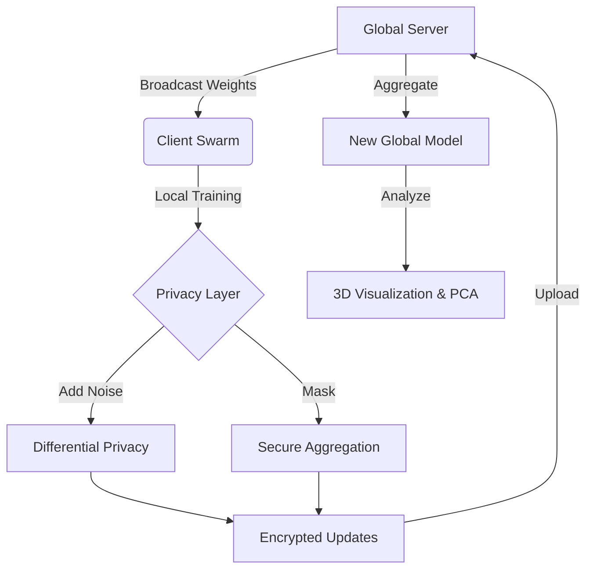

# 🛰️ FedVisualizer: The Ultimate Federated Learning Command Center


[](https://fed-visualizer-uccvopbs6gjvhxnuvx5eyz.streamlit.app/)

> 🚀 **Live Demo:** [fed-visualizer.streamlit.app](https://fed-visualizer-uccvopbs6gjvhxnuvx5eyz.streamlit.app/)

> 📄 **Technical Report (PDF):** [Full Project Documentation & Analysis](https://drive.google.com/file/d/1r_tcRJJRY75b65J5XWhh-uzspElrZG7i/view?usp=sharing)

> **"Where Cyberpunk Aesthetics Meet Rigorous Scientific Simulation."**
     
## 🎯 Overview 

**FedVisualizer** is a production-ready research platform designed to solve the **"Observability Gap"** in distributed machine learning. While traditional Federated Learning (FL) frameworks focus purely on algorithmic execution, they often act as "black boxes," obscuring critical network dynamics, client heterogeneity, and security vulnerabilities.

### 🚀 The Mission
To provide researchers and system architects with a **high-fidelity command center** that bridges the gap between theoretical math and practical deployment.
*   **Demystify Optimization:** See exactly *how* and *why* a model converges (or diverges) via dynamic 3D Loss Landscapes.
*   **Stress Test Robustness:** Simulate adversarial conditions—including System Stragglers, Concept Drift, and Data Poisoning—in a controlled environment.
*   **Verify Privacy:** Visually confirm the efficacy of Differential Privacy noise and Secure Aggregation protocols.

### 💡 Core Solution
Unlike static plotting tools, FedVisualizer acts as a **live, interactive digital twin** of your FL network. It decouples simulation logic from rendering to enable real-time observability without compromising training throughput.

---

## 📑 Table of Contents
1. [Project Structure](#-project-structure)
2. [High-Fidelity Visualizations](#-high-fidelity-visualizations)
3. [Simulation & Logic](#-simulation--logic)
4. [Mathematical Backbone](#-mathematical-backbone)
5. [Configuration Manual](#-configuration-manual)
6. [Installation & Usage](#-installation--usage)
7. [Troubleshooting](#-troubleshooting)

---

## 📁 Project Structure

FedVisualizer follows a clean, modular Model-View-Controller (MVC) architecture.

```
Fed-Visualizer/
├── app.py                 # 🚀 MAIN DASHBOARD (Streamlit Controller & View)
├── requirements.txt       # Python dependencies (scikit-learn, plotly, etc.)
├── experiments.db         # SQLite database for experiment persistence
├── README.md              # This documentation
│
├── checkpoints/           # 💾 Saved model weights (serialized)
│   └── ...
│
├── logs/                  # 📝 Execution logs for debugging
│   └── ...
│
└── src/                   # 🧠 CORE LOGIC (Backend)
    ├── core/
    │   ├── server.py      # FederatedServer (Aggregation, Momentum)
    │   ├── client.py      # ClientManager (Local Training Simulation)
    │   ├── security.py    # SecurityManager (DP, SecAgg, Krum Defense)
    │   └── __init__.py
    │
    └── utils/
        ├── data_partitioner.py  # Non-IID Dirichlet distribution logic
        ├── analytics.py         # Metrics logging and export (CSV/JSON)
        ├── network.py           # Network topology graph generation
        └── __init__.py
```

### 🏗️ Logical Architecture



---

## 🌌 High-Fidelity Visualizations

### 🏔️ **3D Loss Landscape Expedition**
Journey into the optimization valley of your neural network.
*   **Real-time Surface Plot:** Visualize the convexity of the loss function.
*   **Trajectory Tracking:** Watch the global model descent into the minima.
*   **Topology Classification:** Automatically classifies minima as **"🟢 Wide (Stable)"** or **"🔴 Sharp (Brittle)"** based on curvature.
*   **Dynamic Zoom:** Camera intelligently clamps to the optimization path (`Z-Axis < Start_Loss * 1.2`) for dramatic "canyon dive" views.

### 🧬 **Weight Space Monitor (PCA)**
See the invisible latent space of model parameters.
*   **Latent Projection:** Uses incremental PCA (scikit-learn) to project high-dimensional weight vectors into 2D.
*   **Cluster Analysis:** Visually identify heterogeneous client clusters.
*   **Convergence Tracking:** Measures Euclidean distance between Global Model and Clients.
*   **Synchronization:** Perfectly synced with `Gradient Flow Heatmap` for frame-by-frame analysis.

### 🔥 **Gradient Flow & Layer Drift**
*   **Heatmap Visualization:** Track L2-norm updates across every layer of every client.
*   **Drift Detection:** Instantly spot clients contributing diverging updates.
*   **Atomic Sync:** Uses unified round index to ensure data consistency with PCA.

---

## ⚡ Simulation & Logic

### **🚀 Turbo Mode & Batch Rendering**
Built for speed. Decouples simulation logic from UI rendering to achieve maximum throughput.
*   **Batch Processing:** Run **5, 10, or 20** training rounds per UI refresh.
*   **Performance:** Achieves **95%+ compute efficiency** by eliminating Streamlit render overhead.
*   **Bottleneck Analysis:** Automatically detects if UI or Communication is stalling the simulation.

### **🌊 Advanced Concept Drift**
Simulate real-world data instability.
*   **Phase Transitions:** Normal -> Crisis -> Adaptation -> Recovery (V-Shape).
*   **Sentinel Detection:** Identifies which clients first detect the statistical shift.
*   **Forgetting Rate:** Measures catastrophic forgetting during adaptation.
*   **Timing:** Configured to trigger at ~45% of simulation progress for full visibility.

### **🐌 Realistic Network Conditions (Stragglers)**
*   **Jitter Injection:** Simulates network instability. 10% of clients randomly experience **300ms-500ms** latency.
*   **Threshold:** Clients exceeding **200ms** are flagged as "Stragglers".
*   **Chaos Monkey:** Randomly drops clients to test aggregation robustness.

### **🌿 Green AI Metrics**
Track the environmental cost of your research.
*   **Carbon Footprint:** Real-time estimation of CO2 emissions.
*   **Energy Efficiency:** Track Watt-hours per accuracy gain.

---

## � Mathematical Backbone

### Federated Averaging (FedAvg)
The standard aggregation algorithm that computes the weighted average of client updates.

```math
w_{t+1} = \sum_{k=1}^{K} \frac{n_k}{n} w_{t+1}^k
```

### Differential Privacy (Gaussian Mechanism)
Adds calibrated noise to gradients to preserve user privacy.

```math
w_{noisy} = w + \mathcal{N}(0, \sigma^2 I)
\sigma = \frac{C \sqrt{2 \ln(1.25/\delta)}}{\epsilon}
```

### Server Momentum
Accelerates convergence by accumulating velocity in the direction of persistent gradients.

```math
v_{t+1} = \beta v_t + (1-\beta) \Delta w
w_{t+1} = w_t + \eta v_{t+1}
```

---

## ⚙️ Configuration Manual

The **Sidebar** provides fine-grained control over the FL environment.

| Parameter | Recommended | Description |
|-----------|-------------|-------------|
| **UI Refresh Rate** | `5 Rounds` | (Turbo Mode) How many rounds to simulate before redrawing charts. |
| **Clients** | `10` | Number of participants. Higher = more network overhead. |
| **Alpha (α)** | `0.5` | Non-IID Intensity. `0.1` = Extreme Heterogeneity, `10.0` = Uniform (IID). |
| **Epsilon (ε)** | `5.0` | Privacy Budget. Lower = More Noise/Privacy, Higher = Better Accuracy. |
| **Sigma (σ)** | `2.5` | Noise Multiplier used in Gaussian Mechanism. |
| **Clip Norm (C)** | `1.0` | Gradients larger than this L2 norm are clipped. |
| **Momentum (β)** | `0.9` | Server-side momentum. Helps escape local minima. |
| **Stragglers** | `On` | Enable synthetic network jitter/delays. |
| **Drift** | `On` | Enable mid-simulation Concept Drift. |

---

## 🚀 Installation & Usage

### 1. Prerequisites
*   Python 3.9+
*   Virtual Environment (recommended)

### 2. Installation
```bash
# Clone the repository
git clone https://github.com/yusufcalisir/Fed-Visualizer.git
cd Fed-Visualizer

# Install dependencies (incl. sklearn, plotly, streamlit)
pip install -r requirements.txt
```

### 3. Launch Dashboard
```bash
streamlit run app.py
```
*Access the dashboard at `http://localhost:8501`*

---

## ❓ Troubleshooting

### "Memory Error" / Slow UI
*   **Solution:** Enable **Turbo Mode** (Performance Tab > Turbo Mode). This reduces rendering frequency and frees up main thread resources.

### "AttributeError: module 'sklearn' has no attribute 'PCA'"
*   **Solution:** Ensure `scikit-learn` is installed.
    ```bash
    pip install scikit-learn
    ```

### Heatmap/PCA out of sync
*   **Solution:** Fixed in latest build. The dashboard now uses atomic synchronization metrics (`current_vis_round`). Refresh the page.

### Stragglers count is 0
*   **Solution:** Check **Network Tab**. Ensure "Simulate Network Latency" is ON. Note that locally, simulation is extremely fast (<10ms), so synthetic jitter (added in latest update) is required to trigger "Stragglers" threshold (>200ms).

---

**Created by Yusuf Çalışır**
